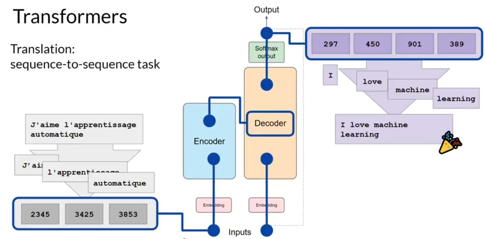

# Week 1: Transformer Architecture

## Goals for Week 1
1. Understanding Transformer model architecture 
2. GenAI project lifecycle

## Foundational Models/Base Models
Some of the foundational models/base models: GPT, BLOOM, BERT, LLaMa, FLAN-T5, PaLM

- More parameter the model has more memory in turn it can perform more sophisticated tasks.
- We will use open-source FLAN-T5 model to carry out language tasks.
- We can use them as they are or fine tune them as per our requirement

### Key Terminology
- **Prompt**: Text that you pass to LLM
- **Context Window**: Space or memory available to the prompt
- **Completion**: It is output of the model (Contains text from prompt and generated text)
- **Inference**: Act of using the model to generate text

## LLM Use Cases and Tasks
- write essay, write summary, translate natural language to machine code, information retrieval called named entity recognition (word classification), Invoke external APIs (more on week 3)
- smaller models can be fine-tuned to perform focussed tasks (more on week 2)

## Text Generation Before Transformers
- **RNNs**: Used to generate/predict next word.
- These models need to understand whole sentence/document to predict well. Not just the previous few words. Problem here is language is complex as one word can have multiple meaning.
- Transformers came in 2017 after the publication of the paper, ["Attention Is All You Need"](https://arxiv.org/abs/1706.03762). 
  - It can be scaled efficiently to use multi-core GPUs
  - It can parallel process input data, making use of much larger training data set
  - Able to learn to pay attention to the meaning of the words it processing.

## Transformers Architecture

### 1. Revolutionary Improvement Over Previous Models
- Transformers dramatically improved natural language processing compared to older RNNs (Recurrent Neural Networks)
- Led to an explosion in AI's ability to generate and understand text

### 2. The Power of Self-Attention
- **Key Innovation**: Transformers can understand relationships between ALL words in a sentence, not just neighboring words
- Uses "attention weights" to determine how relevant each word is to every other word
- **Example**: The model can learn who has the book, who could have it, and whether it's relevant to the context
- **Attention Maps**: Visual representations showing how strongly words are connected to each other

### 3. Two-Part Architecture: Encoder and Decoder
- **Encoder**: Processes and understands input text
- **Decoder**: Generates output text
- Both parts work together and share similarities

### 4. Text Processing Pipeline

#### Step 1: Tokenization
- Converts words into numbers (token IDs)
- Each number represents a position in the model's vocabulary dictionary
- Must use the same tokenizer for training and text generation

#### Step 2: Embedding Layer
- Maps each token ID to a multi-dimensional vector
- Creates a high-dimensional space where similar words are located close together
- Allows mathematical understanding of word relationships and meanings

#### Step 3: Positional Encoding
- Since the model processes all words simultaneously (in parallel)
- Adds position information to preserve word order in sentences

#### Step 4: Multi-Headed Self-Attention
- Multiple attention mechanisms work in parallel (typically 12-100 "heads")
- Each head learns different aspects of language:
  - One might focus on people/entities
  - Another on activities/actions
  - Another on properties like rhyming
- The model learns these aspects automatically during training

#### Step 5: Feed-Forward Network
- Processes the attention-weighted information
- Outputs probability scores for every possible word in the vocabulary

#### Step 6: Final Prediction
- Uses softmax to normalize scores into probabilities
- Selects the most likely next word (though various methods can influence this selection)

### 5. Key Advantages
- **Parallel Processing**: All words processed simultaneously (faster than sequential models)
- **Long-Range Dependencies**: Can understand connections between distant words
- **Contextual Understanding**: Learns meaning based on surrounding context
- **Scalability**: Architecture can be scaled up for better performance

This transformer architecture forms the foundation of modern large language models like GPT, making them capable of understanding and generating human-like text.

### 6. Prediction Process

**Example**: Translation task (French → English: "J'adore l'apprentissage automatique" → "I love machine learning")

#### Step-by-Step Process:

**Encoder Side:**
- **Tokenization**: Input words are converted to tokens using the same tokenizer used during training
- **Embedding**: Tokens are passed through the embedding layer to create vector representations
- **Multi-Head Attention**: Tokens are processed through multi-headed attention layers
- **Feed-Forward Network**: Output from attention layers is processed through feed-forward network
- **Deep Representation**: Encoder output creates a deep representation of the structure and meaning of input sequence

**Decoder Side:**
- **Start Token**: A start-of-sequence token is added to the decoder input
- **Context Integration**: Encoder's deep representation is inserted into the middle of decoder to influence self-attention mechanisms
- **Self-Attention**: Decoder processes the start token using self-attention mechanisms informed by encoder context
- **Feed-Forward Processing**: Output goes through decoder's feed-forward network
- **Softmax Layer**: Final softmax layer produces probability distribution over vocabulary

**Generation Loop:**
- **First Token Prediction**: Model predicts the first output token based on contextual understanding from encoder
- **Iterative Process**: Output token is fed back as input to generate the next token
- **Continue Loop**: Process repeats until model predicts an end-of-sequence token
- **Detokenization**: Final sequence of tokens is converted back to words to produce final output

**Key Points:**
- This was the original objective of transformer architecture designers (sequence-to-sequence tasks)
- The process demonstrates how encoder provides context for decoder's predictions
- Autoregressive generation: each token depends on previously generated tokens

## Summary: Transformer Architecture Components

### Complete Architecture
- **Encoder**: Encodes input sequences into deep representation of structure and meaning
- **Decoder**: Uses encoder's contextual understanding to generate new tokens in a loop until stop condition is reached

### Three Main Variations

#### 1. Encoder-Only Models
- **Function**: Sequence-to-sequence models where input and output sequences are same length
- **Use Cases**: Classification tasks (e.g., sentiment analysis) with additional layers
- **Example**: BERT
- **Note**: Less common these days

#### 2. Encoder-Decoder Models
- **Function**: Perform well on sequence-to-sequence tasks where input and output can be different lengths
- **Use Cases**: Translation, general text generation tasks
- **Examples**: BART, T5 (used in this course labs)

#### 3. Decoder-Only Models
- **Function**: Most commonly used today; can generalize to most tasks as they scale
- **Use Cases**: General text generation, most NLP tasks
- **Examples**: GPT family, BLOOM, Jurassic, LLaMA

### Key Takeaways
- **Scaling Effect**: As models scale, their capabilities grow significantly
- **Flexibility**: Components can be split apart for different architecture variations
- **Practical Use**: Interaction through natural language prompts, not code
- **Next Step**: Prompt engineering - creating effective prompts using written words

### Important Note
- Don't need to remember all technical details
- Focus on understanding differences between model types
- Can reference documentation as needed
- Main interaction is through **prompt engineering**, not coding

