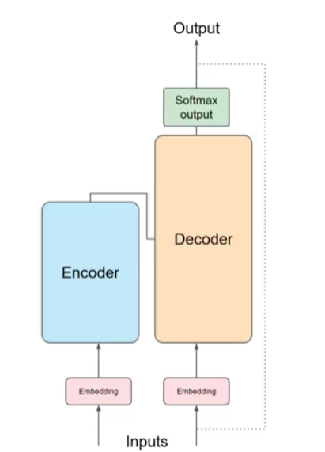

# Week 1: Generative AI with Large Language Models

## Goals for Week 1
1. Understanding Transformer model architecture 
2. GenAI project lifecycle

## Foundational Models/Base Models
Some of the foundational models/base models: GPT, BLOOM, BERT, LLaMa, FLAN-T5, PaLM

- More parameter the model has more memory in turn it can perform more sophisticated tasks.
- We will use open-source FLAN-T5 model to carry out language tasks.
- We can use them as they are or fine tune them as per our requirement

### Key Terminology
- **Prompt**: Text that you pass to LLM
- **Context Window**: Space or memory available to the prompt
- **Completion**: It is output of the model (Contains text from prompt and generated text)
- **Inference**: Act of using the model to generate text

## LLM Use Cases and Tasks
- write essay, write summary, translate natural language to machine code, information retrieval called named entity recognition (word classification), Invoke external APIs (more on week 3)
- smaller models can be fine-tuned to perform focussed tasks (more on week 2)

## Text Generation Before Transformers
- **RNNs**: Used to generate/predict next word.
- These models need to understand whole sentence/document to predict well. Not just the previous few words. Problem here is language is complex as one word can have multiple meaning.
- Transformers came in 2017 after the publication of the paper, "Attention Is All You Need". 
  - It can be scaled efficiently to use multi-core GPUs
  - It can parallel process input data, making use of much larger training data set
  - Able to learn to pay attention to the meaning of the words it processing.

## Transformers Architecture

### 1. Revolutionary Improvement Over Previous Models
- Transformers dramatically improved natural language processing compared to older RNNs (Recurrent Neural Networks)
- Led to an explosion in AI's ability to generate and understand text

### 2. The Power of Self-Attention
- **Key Innovation**: Transformers can understand relationships between ALL words in a sentence, not just neighboring words
- Uses "attention weights" to determine how relevant each word is to every other word
- **Example**: The model can learn who has the book, who could have it, and whether it's relevant to the context
- **Attention Maps**: Visual representations showing how strongly words are connected to each other

### 3. Two-Part Architecture: Encoder and Decoder
- **Encoder**: Processes and understands input text
- **Decoder**: Generates output text
- Both parts work together and share similarities

### 4. Text Processing Pipeline

#### Step 1: Tokenization
- Converts words into numbers (token IDs)
- Each number represents a position in the model's vocabulary dictionary
- Must use the same tokenizer for training and text generation

#### Step 2: Embedding Layer
- Maps each token ID to a multi-dimensional vector
- Creates a high-dimensional space where similar words are located close together
- Allows mathematical understanding of word relationships and meanings

#### Step 3: Positional Encoding
- Since the model processes all words simultaneously (in parallel)
- Adds position information to preserve word order in sentences

#### Step 4: Multi-Headed Self-Attention
- Multiple attention mechanisms work in parallel (typically 12-100 "heads")
- Each head learns different aspects of language:
  - One might focus on people/entities
  - Another on activities/actions
  - Another on properties like rhyming
- The model learns these aspects automatically during training

#### Step 5: Feed-Forward Network
- Processes the attention-weighted information
- Outputs probability scores for every possible word in the vocabulary

#### Step 6: Final Prediction
- Uses softmax to normalize scores into probabilities
- Selects the most likely next word (though various methods can influence this selection)

### 5. Key Advantages
- **Parallel Processing**: All words processed simultaneously (faster than sequential models)
- **Long-Range Dependencies**: Can understand connections between distant words
- **Contextual Understanding**: Learns meaning based on surrounding context
- **Scalability**: Architecture can be scaled up for better performance

This transformer architecture forms the foundation of modern large language models like GPT, making them capable of understanding and generating human-like text.

